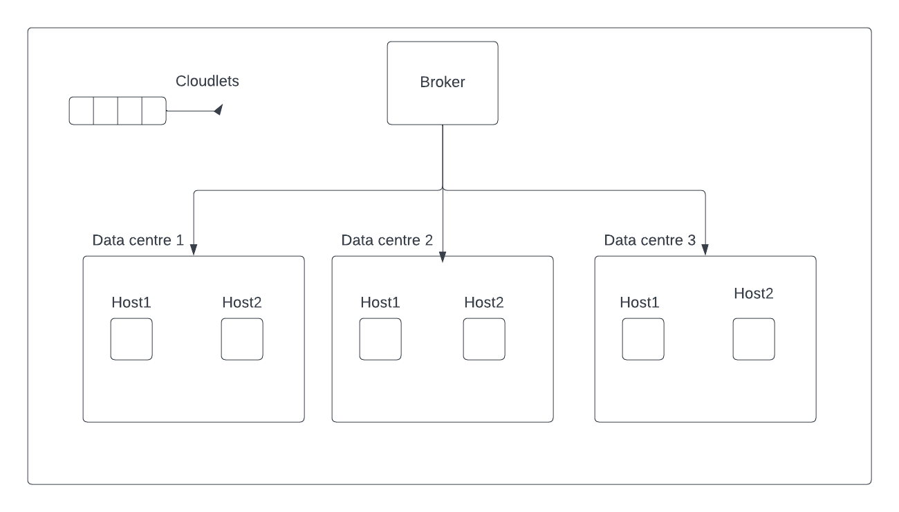
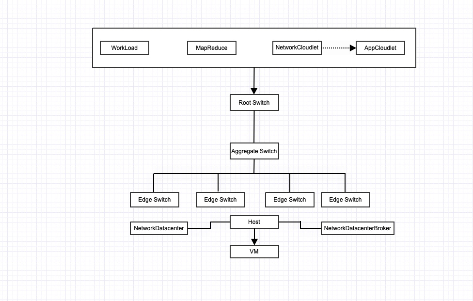
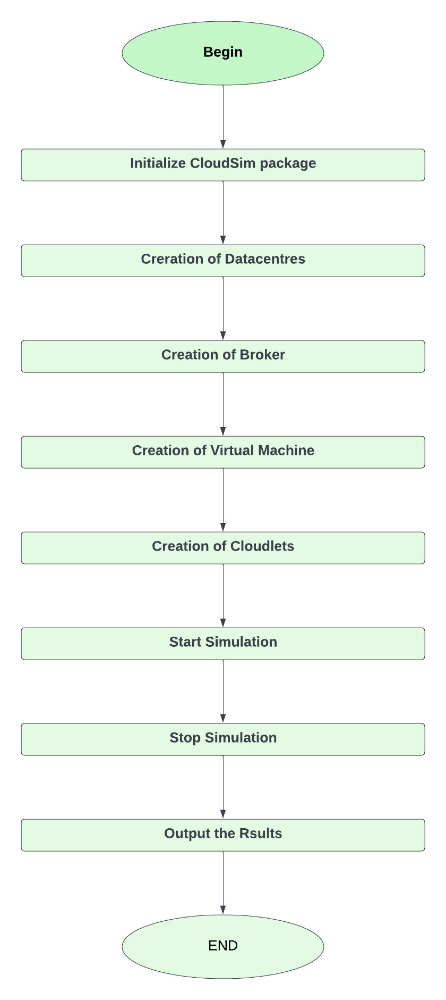
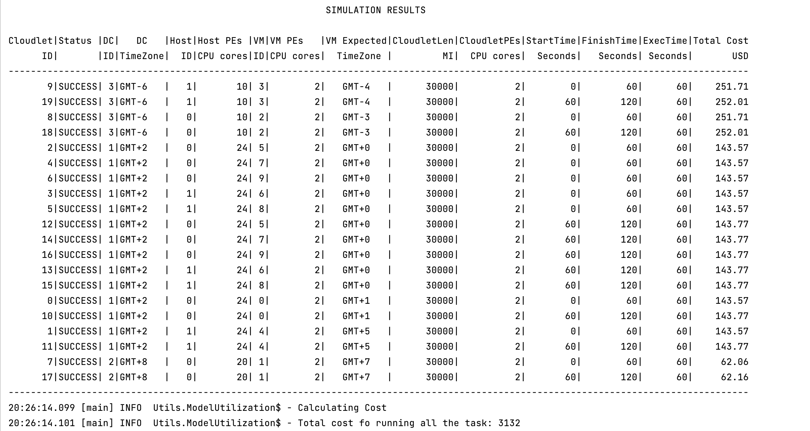
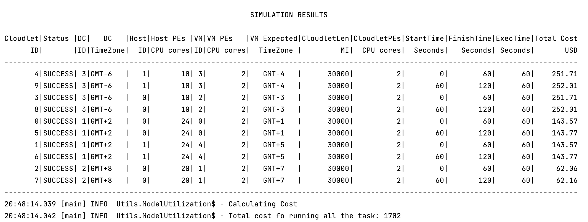
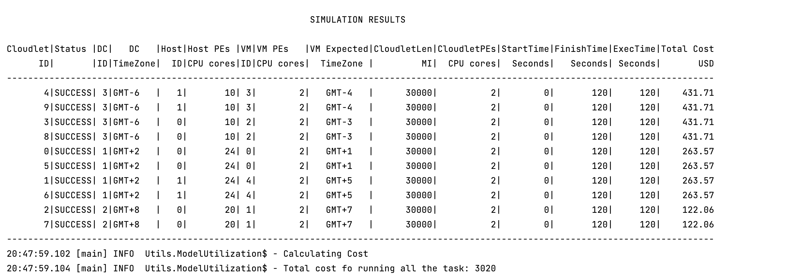
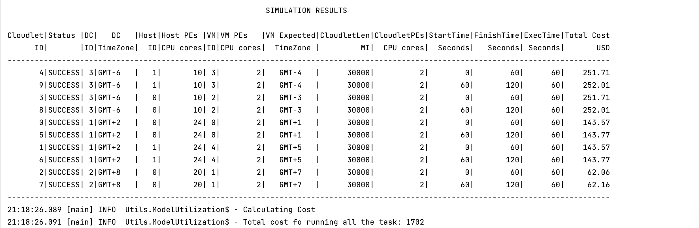
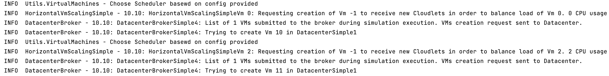
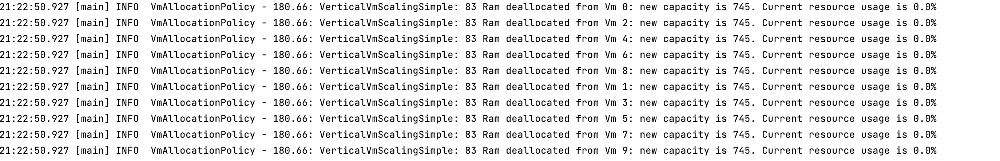
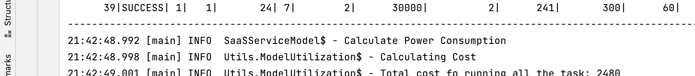

# Cloud Simulations
## Homework 3

### Srikanth Kyatham [UIN - 663943205]


### Environment:
**OS** : Mac OS

### PreRequisites:
- SBT
- Java 17
- Scala 3.0.2
- Cloud SimPlus 6.4.3

### Homework Problem :
LogFileGenerator : https://github.com/0x1DOCD00D/CS441_Fall2022/blob/main/Homeworks/Homework3.md

### Cloud Architecture :

### Overiew :


### Network Switches :


### Process Flow :


### Steps to run the project.
1. Clone the repository .
2. Change Directory to the MyCloudProvider root directory in terminal/command prompt.
3. Run below command to build project .
    ```
    sbt clean compile
    ```
4. Please use below command to run Project.
    ```
    sbt clean run
    ```
5. Below is the Sample Output.

   
   ---


### Cloud Simulations :
This Repository contains multiple simulations  with different policies :
1. **SpaceSharedSimulation**
2. **TimeSharedSimulation**
3. **ScalingSimulation**
4. **SaaSSimulation**
5. **PaaSSimulation**
6. **IaaSSimulation**
7. **FaaSSimulation**
8. **NetworkSimulatuionBuild**
9. **VmAllocationPolicyWithTimeZonePreferance**


### SpaceSharedSimulation vs TimeSharedSimulation

1. SpaceSharedSimulation : The resource may be partitioned into sets of processors (clusters). Each cluster is allocated to a single cloudlet that is allowed to run to completion
2. TimeSharedSimulation : More than one Cloudlet may be allocated to a cluster, in which case each Cloudlet runs for some quantum of time before being preempted to allow other jobs to run.

Analysis : As we can see Total cost is less for SpaceShared than Time Shared as resourcers are efficently utilized
Belown is Output :
### SpaceShared cost : 1702


### TimeShared cost : 3020

### Vm Allocation with Time Zone Preferance

As we can see in Below image Vm are allocated to the Data center which are closed to respective time Zone :




### Auto Scaling 

As we can see in Below image we can see Vms are Auto scaled based on threshold :
### Horizontal Scaling :

### Vertical Scaling :



### Cloud Services

1. SaaS   - User submits cloudlets cloud provider provides vms
2. IaaS   - User can request for Vm with custom resource Configuration
3. PaaS   - User can request for Vm along with cloudlets
4. FaaS   - User submits cloudlets cloud provider provides vms and Cloud provider handles allocation and
   auto scaling of resources based on need

### SaaS Cost  : 2480


### PaaS Cost  : 10070


### IaaS Cost  : 5720


### FaaS Cost : 2480


